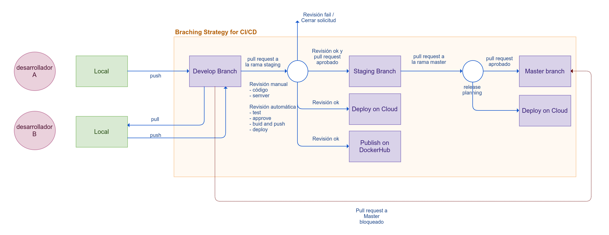
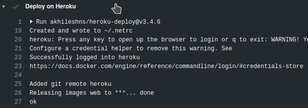

# Handytec-webapp

## Notas importantes

- Actualmente la aplicación ya está desplegada en Heroku. Puede acceder a la URL `https://handytec-webapp.herokuapp.com/health` o `https://handytec-webapp.herokuapp.com`

- En el [repositorio actual](https://github.com/davidenq/handytec-webapp) se pueden ver todos los cambios realizados, [pull request](https://github.com/davidenq/handytec-webapp/pulls) solicitados, procesos de ci/cd a través de la pestaña [Actions](https://github.com/davidenq/handytec-webapp/actions) y ver que ha pasado y que ha fallado.

- La imagen docker de acceso públic está publicada en DockerHub. Ver [aquí](https://hub.docker.com/repository/docker/davidenq/handytec-webapp)

## Resumen

- Estrategia de versionamiento: Semver
- Estrategia de branching: Gitflow
- Herramienta para CI/CD: GitHub Actions
- Control de versiones: GitHub
- Versionamiento de imagenes públicas en Dockerhub: Semver (etiquetado automático basado en la versión del archivo package.json)
- Versionamiento de imagenes privadas en Heroku: SHA

## Información general

El presente prototipo resuelve los casos 1 y 2 propuestos como evaluación técnica para la posición de ingeniero DevOps

A continuación se presenta un `checklist` de las tareas solicitadas y cuales han sido completadas.

**_Caso/Ejercicio 1_**

- [x] Desplegar una aplicación desarrollada en Javascirpt en la nube de Heroku
- [x] Crear una estrategia de versionamiento en Github
- [x] Crear una estrategia de fusión de ramas
- [x] \*\*Crear un pipeline de CI/CD que pueda ser fácilmente replicable (replicable en otros proyectos? procesos?)
- [x] Verificar que la aplicación esté desplegada sin ingresar al sitio web

**_Caso/Ejercicio 2_**

- [x] La aplicación anterior debe tener una imagen Docker para ser replicada por el equipo de desarrolladores en un ambiente local
- [x] Documentar (de manera general) en alguna herramienta de su preferencia, el proceso de CI/CD y versionamiento definidos
- [x] \*\*Crear una imagen Docker con la aplicación del ejercicio anterior (similar al a 1?)
- [x] Cualquier desarrollador podrá hacer pull de la imagen y configurar en su entorno local, incluyendo el repositorio del código versionado.

> Nota: Aquellos `items` del `checklist` marcados con doble asterisco son descripciones ambiguas/duplicadas o están dentro del mismo contexto de otro `item` del `checklist`.

## Estrategia de Versionamiento

El versionamiento adoptado para el presente prototipo es [(Semver)](https://semver.org/lang/es/). Semver es ampliamente adoptado en la industria de software y permitirá que el desarrollo
de la aplicación sea ágil, rastreable y se pueda comprender el estado de un proyecto con sus dependencias.

## Estrategia de fusión de ramas

Existen multiples estrategias de flujos de git para el manejo de `branchs` entre las cuales se pueden citar:

1. [Gitflow](https://nvie.com/posts/a-successful-git-branching-model/)
2. [Github Flow](https://guides.github.com/introduction/flow/)
3. [GitLab Flow](https://docs.gitlab.com/ee/topics/gitlab_flow.html)
4. [One Flow](https://www.endoflineblog.com/oneflow-a-git-branching-model-and-workflow)
5. [Release Flow by Microsoft](https://docs.microsoft.com/en-us/azure/devops/learn/devops-at-microsoft/release-flow)- [Trunk Based Development](https://trunkbaseddevelopment.com/)

Cada una tiene sus [props y sus contras](https://medium.com/@patrickporto/4-branching-workflows-for-git-30d0aaee7bf), sin embargo la estrategia de seleccionar una de ellas está dado
por las necesidades de la empresa y los proyectos que esta maneje. Por ejemplo, Gitflow tiene muchos errores cuando los proyectos son demasiado grandes y las estrategias de CI/CD también se vuelven más
complejas de manejarlas [https://www.endoflineblog.com/gitflow-considered-harmful].
Por otro lado, [Github flow](https://youtu.be/ppzIBIQz_KY) también tiene sus desventajas en procesos de CI/CD dado que el flujo de manejo de ramas y despliegues está dado por un único flujo o rama principal.

Sin embargo, en este documento, no se presenta una discusión formal acerca de las ventajas o desventajas de cada uno de los flujos. El propósito principal es proveer una estrategia inicial como propósito de demostración del flujo CI/CD
desde el desarrollo en local, hasta el despligue en la nube de Heroku.

[Gitflow](https://nvie.com/posts/a-successful-git-branching-model/) ha sido seleccionado para el presente proyecto.

Aunque en la definición formal de Gitflow, hay una serie de branches tales como Feature, Hotfix, Support, Release, entre otras, las ramas que actualmente han sido implementadas son:

- develop: Utilizada para que los equipos de desarrolladores
- staging
- master

Las ramas indicadas anteriormente tienen el propósito de demostrar el flujo completo de CI/CD, no desde el punto de vista de un desarrollador que agregará nuevas características a la aplicación, corregirá errores, etc., sino desde el punto de vista de un DevOps quién tiene la responsabilidad de gestionar las ramas principales para el proceso de integración y despliegue/entraga continua. Para mayor información de la estrategia de manejo de ramás para el equipo de desarrolladores, puede revisar [aquí](https://www.atlassian.com/es/git/tutorials/comparing-workflows/gitflow-workflow).

Para el proyecto actual, a continuación se presenta una estrategía de branchs con GitFlow


1. El desarrollador puede clonar el repositorio
2. Se realiza los cambios en su local
3. Se realiza push a la rama de develop en el repositorio remoto
4. Se solicita la extracción del código en la rama staging

- esta rama es utilizada para proveer un ambiente de staging para pruebas en cloud

5. Se realiza una revisión manual y una revisión automática

- generalmente la revisión manual está asociado a una práctica de revisión de buenas prácticas de desarrollo (clean code) y versionamiento. Esta revisión se da en pares y se realiza comentarios de ser necesario cuando se requiere mejorar algo en el código, de paso la solicitud de extracción queda rechazada.
- la revisión automática está enfocado en la integración continua: - que los cambios de un desarrollador no afecten ni rompan la aplicación - que las pruebas unitarías pasen con éxito (si se escribieron pruebas unitarias) - que el coverage del código cumpla con un umbral mínimo. Por ejemplo, sin un desarrollador realiza unos cambios sustanciales sin escribir pruebas unitarias, el coverage del código puede bajar a tal punto de que no cumple el requisito mínimo de cubrir el código. - que el proceso de building de la imagen docker (si es que se trabaja con contenedores) puedan realizar el proceso de building sin problemas (dependencias, versiones, imagenes bases desactualizadas, herramientas de compilación, etc., podrían dar problemas) - que el proceso de deploy en el ambiente correspondiente esté ok.
  Con todas estas revisiones cumplidas, ahora se puede realizar la aprobación de la solicitud de estracción en la rama staging

6. Se realiza una solicitud de extracción (manual o automática) a la rama master para desplegar en producción. Esto depende de varios factores como por ejemplo, cambios críticos o hotfixes que después de haberse verificado en la rama de staging, ya es posible pasar a producción previa aprobación del core del negocio. Además, puede que se agreguen nuevas funcionalidades y que ya se hayan probado en staging, sin embargo, la aprobación de la puesta a producción quedará determinada por el core del negocio. Por lo tanto, se realiza una planificación para dicho proceso.

> Nota 1: Las solicitudes de extración de cualquier rama que no sea staging serán bloqueadas
> Nota 2: Los ambientes de calidad también son muy importantes y con ello la rama que estará asociada. Esta etapa corresponde a un ambiente netamente para pruebas tipo Smoth, Load y Estress que son muy importantes para probar la capacidad de la aplicación en entorno reales, altamente concurrentes y críticos. Sin embargo, para este esceneario, dicha etapa no se ejecuta como una estrategia de branchs.

## Servicios / Librerías / Herramientas utilizadas

- git-flow
- github actions
- [Github](https://github.com)
- [Heroku](https://www.heroku.com/)
- [Heroku-Deply](<[akhileshns/heroku-deploy@v3.4.6](https://github.com/AkhileshNS/heroku-deploy)>) GitHub Action para desplegar el contenedor Docker en Heroku

# Pruebas

## Requerimientos

- Docker. Cómo instalar para [Windows](https://docs.docker.com/docker-for-windows/install/), [Linux](https://docs.docker.com/engine/install/) o [Mac](https://docs.docker.com/docker-for-mac/install/)
- Docker-Compose (no obligatorio). Cómo instalar [docker-compose](https://docs.docker.com/compose/install/)
- Make (no obligatorio) (Para GNU/Linux y Mac, viene instalado por defecto. Para Windows puede instalar make descargando los binarios [acá](http://gnuwin32.sourceforge.net/packages/make.htm))
- Node.js > 12

## ¿Cómo probar en local?

### Descargando la imagen base

- Realizar pull de la imagen `docker pull davidenq/handytec-webapp:0.1.0`
- Ejecutar el comando `docker run -d -t -i -p 3000:3000 -e PORT=3000 -e NODE_ENV=development davidenq/handytec-webapp:0.1.0`
- Verificar que el contenedor esté ejecutandose: `docker ps -a`
- Abrir el navegador e ingresar a la url `localhos:3000`. El servidor devolverá un objeto JSON
  ```
  {"status":"ok","code":200,"data":"Hi Handytec!"}
  ```
  > Nota: Ningún desarrollo se puede hacer con este flujo. Simplemente sirve para probar

### Clonando el repositorio

- Clonar el proyecto `git@github.com:davidenq/handytec-webapp.git`
- Ejecutar

  - con docker-compose `docker-compose up` (es necesario tener instalado docker-compose)
  - con make `make build && make run` (es necesario tener instalado make en caso de trabajar con Windows)
  - sin docker: `npm run dev` (es necesario tener instalado node.js)

## Desarrollo

Antes de empezar a desarrollar, debe clonar el repositorio `git@github.com:davidenq/handytec-webapp.git`.
Ahora, para desarrollar, existen dos formas de hacerlo:

1. Sobre Docker
   - En este caso, necesita tener instalado docker-compose.
   - Ejecute `docker-compose up`, utomáticamente se creará y levantará el contenedor de la aplicación instalando todas las dependencias correspondientes.
   - Los cambios que realice en el código fuente surtirán efecto de forma instantanea dado que docker-compose crea un volumen y un enlace simbólico al código fuente.
2. Sin Docker
   - En este caso, necesita tener instalado node.js.
   - Instalar las dependencias de node.js ejecutando `npm install`
   - Ejecutar `npm run dev` para empezar a desarrollar.

> Nota: En ambos casos, para el ambiente de desarrollo se utiliza [`nodemon`](https://www.npmjs.com/package/nodemon) para obtener el beneficio de `hotreload`

## Puesta en staging

Cada vez que el desarrollador realice un commit a la rama de develop, posteriormente deberá realizar una solicitud de extracción desde la rama de develop a la rama de staging. Con este proceso, se ejecutará una serie de pasos dentro de un flujo de trabajo. Estas pasos (también llamados jobs) son:

1. test: En esta etapa se instalan las dependencias del proyecto y se procede a ejecutar las pruebas unitarias.
   Para este propósito se ha agregado una única prueba unitaria (ver la carpeta `test`). Si una prueba falla, se detendrá el proceso de ci/cd.
   Pueden haber diferentes tipos de pruebas que permitan verificar que el código es de calidad. Por ejemplo, porcentaje de covertura de código mínima. Si no se cumple con dicha restricción, el proceso de ci/cd se detiende automáticamente. Para este caso, no se han aplicado dichas restricciones, sin embargo, si desea probar dicha restricción, puede reemplazar el script de pruebas actual especificado en `package.json` con `"test": "lab -v **/*.test.js -t 100 -L"`. Dado que el código no tiene las pruebas de cobertura suficiente, las pruebas no pasarán y el proceso de ci/cd se detendrá.

2. approve: Si las pruebas pasan exitosamente, la aprobación se realizará automáticamente gracias a un script de GitHub Actions, desarrollado por la comunidad.
3. build-and-push-on-dockerhub: Posteriormente, si la etapa de aprobación fue exitosa, entonces se construirá la imagen y se alojará en DockerHub (Este paso no es importante, sin embargo dada la definición del enunciado, se realiza como un proceso de ci/cd automático)
4. deploy-on-heroku: Finalmente, cuando la aprobación se ha dado, se procederá a desplegar la aplicación. La comunidad provee un Github Actions con soporte no solo para desplegar sino también para construir la imagen, publicarla en los registros de Heroku, desplegarla y, finalmente, probar que la aplicación esté arriba.
   En el archivo `staging.yaml` dentro de `./.github/workflows` se puede ver la configuración correspondiente para desplegar la aplicación en Heroku. Se puede visualizar un:

- healthcheck que corresponde a un endpoint para ver el estado de la aplicación.
- checkstring con valor ok, que es el valor que se va a comparar con lo que devuelve la aplicación para determinar que todo está ok.
  

```
deploy-on-heroku:
    needs: approve
    runs-on: ubuntu-latest
    steps:
      - name: Checkout code
        uses: actions/checkout@v2

      - name: Deploy on Heroku
        uses: akhileshns/heroku-deploy@v3.4.6
        with:
          heroku_api_key: ${{secrets.HEROKU_API_KEY}}
          heroku_app_name: ${{secrets.HEROKU_APP_NAME}}
          heroku_email: ${{secrets.HEROKU_EMAIL}}
          usedocker: true
          docker_build_args: |
            NODE_ENV
            PORT
          branch: staging
          healthcheck: "https://${{secrets.HEROKU_APP_NAME}}.herokuapp.com/health"
          checkstring: "ok"
          delay: 5
        env:
          NODE_ENV: staging
          PORT: 3000

```

> Nota: Cada una de las etapas (1,2,3, y 4) tiene dependencia directa de otras etapas. Por ejemplo, para pasar a la etapa `approve`, primero se deberá haber pasado la etapa `test`, para pasar la etapa `build-and-push-on-dockerhub` se deberá pasar la etapa `approve` y así. Este es un flujo que debe cumplirse y definirse en el archivo de configuración. Sin estas dependencias, Github Actions ejecutará de forma paralela todas las etapas.

## Puesta en producción

Se puede copiar y pegar el mismo contenido de `staging.yaml` para generar un pipeline para la puesta en producción del proyecto y basado en la rama Master. Sin embargo, hay otros detalles que resolver conjuntamente con el equipo de infraestructura y no solo el flujo de CI/CD, y realizar otros procesos automaticos como por ejemplo el levantamiento automático de la infraestructura, la creación y asociación dinámica de los DNSs, protocolos de seguridad (HTTPS), configuración balanceadores de carga, configuraciones de red y un sin fin de actividades que están determinados por el servicio que se desee utilizar para desplegar la aplicación. Por ejemplo, si se desea desplegar la aplicación en un servicio AWS Fargate o Google Cloud Run, parte de la infraestructura está solventada puesto que ya lo gestionan los propios servicios. Pero si se desea desplegar un proyecto con una arquitectura de microservicios o arquitectura de serverless, los pipeplines, scripts y demás herramientas pueden cambiar totalmente.
